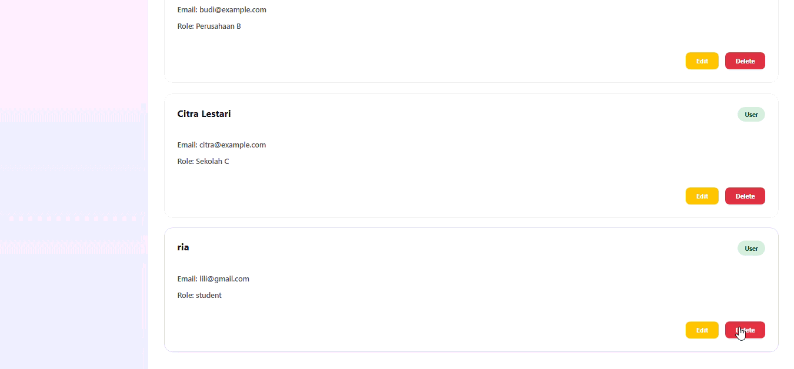

# TP7DPBO2425C1
Saya Hawa Dwiafina Azahra dengan NIM 2400336 mengerjakan Tugas Praktikum 7 dalam mata kuliah Desain dan Pemrograman Berorientasi Objek untuk keberkahanNya maka saya tidak melakukan kecurangan seperti yang telah dispesifikasikan. Aamiin.

## 1. Tema Website
Website yang dibuat adalah sistem manajemen jadwal dengan nama "Best Schedule". Jadi intinya, website ini dibuat buat bantu orang-orang ngatur jadwal dan aktivitas mereka biar gak ada yang kelupaan. Website ini punya fitur pengingat otomatis yang bakal ngingetin kita kalau ada jadwal penting.

Fitur-fitur yang ada di website ini:
- Bisa ngelola data pengguna lengkap sama instansi mereka
- Bisa bikin jadwal baru, edit, hapus, dan lihat statusnya
- Ada reminder otomatis yang kirim pengingat di waktu-waktu penting
- Dashboard yang interaktif buat lihat semua jadwal
- Bisa upload file pendukung buat setiap jadwal

## 2. STRUKTUR DATABASE

Database yang dipakai terdiri dari 3 tabel utama yang saling berhubungan. Berikut penjelasannya:

### Tabel User
Tabel ini nyimpen data pengguna sistem. Strukturnya kayak gini:
- **id_user**: Nomor ID unik untuk setiap user (auto increment, jadi otomatis nambah sendiri)
- **nama**: Nama lengkap usernya (maksimal 100 karakter)
- **email**: Email user (maksimal 100 karakter)
- **instansi**: Nama institusi atau organisasi tempat user bekerja (maksimal 100 karakter)

Hubungannya dengan tabel lain: Satu user bisa punya banyak jadwal (schedule). Jadi misalnya ada user A, dia bisa bikin jadwal meeting, jadwal presentasi, jadwal deadline, dll.

### Tabel Schedule
Tabel ini nyimpen semua jadwal atau aktivitas yang udah dijadwalin. Isinya:
- **id_schedule**: ID unik untuk setiap jadwal (auto increment)
- **id_user**: ID user yang punya jadwal ini (foreign key dari tabel user)
- **nama_aktivitas**: Judul atau nama aktivitasnya (maksimal 200 karakter)
- **deskripsi**: Penjelasan lengkap tentang aktivitasnya (text panjang)
- **tanggal**: Tanggal dan jam pelaksanaannya (format datetime)
- **status**: Status jadwalnya, ada 3 pilihan: 'belum dimulai', 'berlangsung', atau 'selesai'
- **file_tambahan**: Kalau ada file pendukung, path-nya disimpen disini (opsional, maksimal 255 karakter)

Hubungannya: Setiap jadwal pasti milik satu user tertentu. Terus satu jadwal bisa punya banyak reminder.

### Tabel Reminder
Tabel ini nyimpen data pengingat yang terkait sama jadwal. Strukturnya:
- **id_reminder**: ID unik untuk setiap reminder (auto increment)
- **id_schedule**: ID jadwal yang mau diingetin (foreign key dari tabel schedule)
- **tanggal_kirim**: Kapan reminder ini bakal dikirim (datetime)
- **pesan**: Isi pesan remindernya (text)
- **status**: Status reminder, ada 2: 'tertunda' (belum dikirim) atau 'terkirim' (udah dikirim)

Hubungannya: Banyak reminder bisa dihubungkan ke satu jadwal. Jadi satu jadwal bisa punya beberapa reminder di waktu yang berbeda-beda.

### Relasi Antar Tabel
Kalau digambarin hubungannya:
- USER punya banyak SCHEDULE
- SCHEDULE punya banyak REMINDER
- Kalau USER dihapus, semua SCHEDULE dan REMINDER miliknya juga ikut kehapus otomatis

## 3. CODE FLOW

### Koneksi Database
Pertama kali sistem jalan, dia bakal bikin koneksi ke database. File `config/database.php` yang ngatur ini. Koneksi pakai PDO (PHP Data Objects) biar lebih aman dari SQL injection. Di file ini juga diatur charset UTF-8 dan error handling-nya. Outputnya adalah objek koneksi yang siap dipakai buat query ke database.

### Manajemen User (Kelola Pengguna)

#### Cara Tampilkan Daftar User
Kalau kita buka halaman `users.php`, sistem akan manggil fungsi `getAllUsers()` dari class User. Fungsi ini jalanin query SELECT untuk ngambil semua data user dari database terus ditampilin di halaman dalam bentuk tabel atau list.

#### Cara Tambah User Baru
Prosesnya dimulai dari halaman `addUsers.php`. User ngisi form dengan data nama, email, dan instansi. Setelah form disubmit, data dikirim ke class User lewat fungsi `addUser()`. Fungsi ini jalanin query INSERT untuk masukin data user baru ke database. Kalau berhasil, user akan diredirect ke halaman daftar user dengan notifikasi sukses.

#### Cara Edit User
Kalau mau edit data user, kita masuk ke halaman `editUsers.php`. Halaman ini pertama-tama load data user yang mau diedit berdasarkan id_user yang dikasih. Data ini ditampilin di form yang udah terisi. Kalau user ubah data terus submit, sistem manggil fungsi `updateUser()` yang jalanin query UPDATE untuk ngubah data di database.

#### Cara Hapus User
Proses hapus user lebih kompleks karena harus hapus data terkait juga. Ketika fungsi `deleteUser()` dipanggil, sistem akan:
1. Pertama, hapus semua reminder yang terkait dengan jadwal-jadwal user tersebut
2. Kedua, hapus semua jadwal milik user tersebut
3. Terakhir, baru hapus data user itu sendiri

Kenapa urutannya kayak gini? Karena ada relasi foreign key. Kita gak bisa hapus user kalau masih ada jadwal yang nge-refer ke user tersebut. Dan gak bisa hapus jadwal kalau masih ada reminder yang nge-refer ke jadwal tersebut. Ini namanya cascade delete.

### Manajemen Jadwal

#### Cara Tambah Jadwal Baru dengan Reminder Otomatis
Ini yang menarik. Ketika user bikin jadwal baru lewat `addSchedule.php`, prosesnya kayak gini:
1. User ngisi form dengan nama aktivitas, deskripsi, tanggal pelaksanaan, status, dan mungkin upload file
2. Data form dikirim ke fungsi `addSchedule()` dari class Schedule
3. Fungsi ini jalanin query INSERT untuk masukin jadwal baru ke database
4. Setelah berhasil, sistem dapet ID jadwal yang baru dibikin (last insert ID)
5. Semua reminder ini statusnya masih 'tertunda' karena belum dikirim
6. Terakhir, user diredirect ke halaman daftar jadwal dengan notifikasi sukses

#### Cara Edit Jadwal
Kalau mau edit jadwal, prosesnya lebih simpel. Halaman `editSchedule.php` pertama-tama ambil id_schedule dari URL, terus load data jadwal yang ada. Data ini ditampilin di form. Kalau user ubah data terus submit, fungsi `updateSchedule()` dipanggil dan jalanin query UPDATE untuk ngubah data jadwal di database.

#### Cara Hapus Jadwal
Untuk hapus jadwal, sistemnya harus hapus reminder-nya dulu baru hapus jadwalnya. Jadi fungsi `deleteSchedule()` akan:
1. Jalanin query DELETE untuk hapus semua reminder dengan id_schedule tersebut
2. Baru jalanin query DELETE untuk hapus jadwal itu sendiri

### Sistem Reminder Otomatis

#### Cara Kerja Generasi Reminder
Seperti yang udah dijelasin di bagian tambah jadwal, sistem otomatis bikin 4 reminder dengan waktu yang berbeda-beda. Ini dilakukan oleh fungsi `generateReminders()` yang nerima parameter id_schedule, tanggal jadwal, dan nama aktivitas. Fungsi ini menghitung mundur dari tanggal jadwal untuk nentuin kapan masing-masing reminder harus dikirim, terus insert semua reminder ke database dengan status 'tertunda'.

#### Cara Kelola Reminder
Di halaman `reminders.php`, kita bisa:

**Lihat Semua Reminder**: Fungsi `getAllReminders()` dipanggil untuk ngambil data reminder dari database. Query-nya pake JOIN sama tabel schedule biar bisa nampilin nama aktivitasnya juga. Hasilnya ditampilin dalam bentuk list.

**Kirim Reminder**: Kalau ada reminder yang udah waktunya dikirim, kita bisa klik tombol kirim. Ini akan manggil fungsi `updateStatus()` yang ngubah status reminder dari 'tertunda' jadi 'terkirim'. Query UPDATE dijalanin untuk ngubah statusnya di database.

**Hapus Reminder**: Kalau mau hapus reminder (misalnya jadwal dibatalin), tinggal klik tombol delete. Fungsi `deleteReminder()` akan jalanin query DELETE untuk hapus reminder dari database.

### Dashboard

Dashboard ini halaman utama yang nampilin overview dari semua data. Prosesnya:

1. **Ambil Data User Aktif**: Sistem jalanin query untuk ngambil data user yang lagi login atau user pertama di database (SELECT * FROM user LIMIT 1). Data ini ditampilin di User Info Card.

2. **Ambil Semua Jadwal**: Sistem jalanin query SELECT dengan JOIN ke tabel user buat ngambil semua jadwal beserta nama user yang punya jadwal tersebut. Query ini bisa dikasih filter berdasarkan status (belum dimulai, berlangsung, atau selesai) kalau user milih filter. Hasilnya diurutkan berdasarkan tanggal terbaru. Data ini ditampilin di Activities List.

3. **Dashboard**: Setelah semua data terkumpul, dashboard nge-render beberapa komponen:
   - Card info user yang lagi aktif
   - Widget kalender untuk pilih tanggal
   - List semua aktivitas dengan opsi filter status
   - Panel khusus untuk aktivitas hari ini atau tanggal yang dipilih

## 4. FITUR-FITUR 

### Filter dan Pencarian
Sistem punya beberapa fitur filter dan search:
- Bisa filter jadwal berdasarkan status (tampilin semua, cuma yang belum dimulai, cuma yang lagi berlangsung, atau cuma yang udah selesai)
- Bisa filter jadwal berdasarkan tanggal tertentu
- Bisa search user berdasarkan nama atau email mereka

### Status Tracking Jadwal
Setiap jadwal punya lifecycle dengan 3 status:
- **Belum Dimulai**: Jadwal yang baru dibuat dan masih menunggu waktu pelaksanaan
- **Berlangsung**: Jadwal yang sedang dikerjakan atau sedang dalam proses
- **Selesai**: Jadwal yang udah selesai dikerjakan

Status ini bisa diubah-ubah sesuai progress aktivitas.

### File Attachment
User bisa upload file pendukung untuk setiap jadwal. Misalnya kalau ada jadwal meeting, bisa upload file agenda meeting atau materi presentasi. File yang diupload path-nya disimpen di database, terus ditampilin dengan icon dan nama file di tampilan jadwal.

### Status Reminder
Reminder juga punya status buat tracking:
- **Tertunda**: Reminder yang belum dikirim, masih nungguin waktu pengiriman
- **Terkirim**: Reminder yang udah dikirim ke user

## Dokumentasi

### USER

### SCHEDULE

### REMINDER

